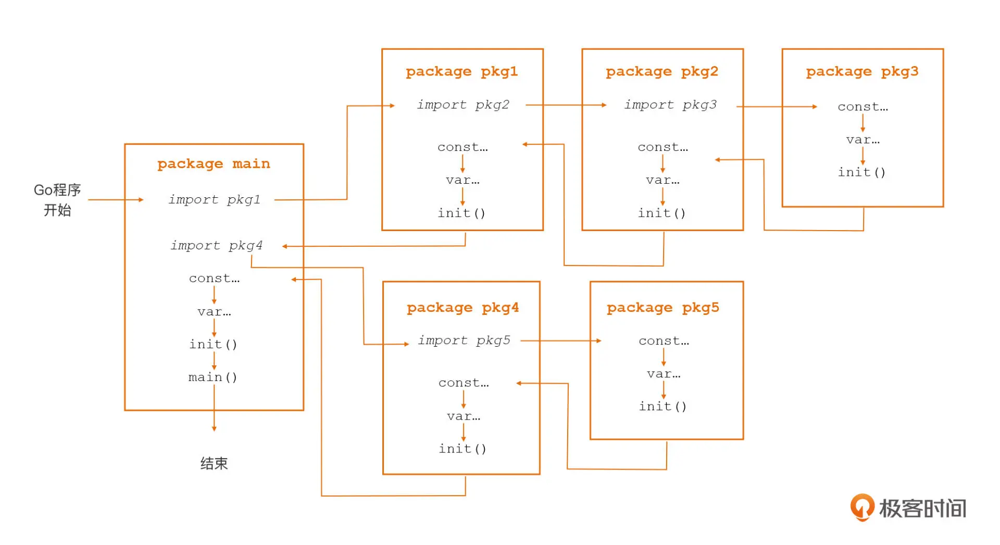

## 03｜配好环境：选择一种最适合你的Go安装方法


###  配置 GOPROXY 这个 Go 环境变量

- ubuntu
```sh
export GOPROXY="socks5://127.0.0.1:1080,direct"


# go: finding module for package github.com/sirupsen/logrus
# github.com/bigwhite/module-mode imports
#         github.com/sirupsen/logrus: invalid proxy URL scheme (must be https, http, file): socks5://127.0.0.1:1080
unset GOPROXY

export GOPROXY="https://proxy.golang.org,direct"
unset GOPROXY


export GOPROXY="https://goproxy.cn,direct"
```


## 04｜初窥门径：一个Go程序的结构是怎样的？


## 06｜构建模式：Go是怎么解决包依赖管理问题的？


### 创建你的第一个 Go Module


1. 新建项目及main.go文件
```go
// chapter06/main.go
package main

import (
	"github.com/google/uuid"
	"github.com/sirupsen/logrus"
)


func main() {
	logrus.Println("Hello ,go module mode\n")
	logrus.Println(uuid.NewString())
}

```

2. 通过 go mod init 创建 go.mod 文件，将当前项目变为一个 Go Module(TODO:项目和Module啥意思？)
```go
// 执行命令: go mod init github.com/bigwhite/module-mode
// go.mod
module github.com/bigwhite/module-mode  // 声明 module 路径 (module path)

go 1.18

```

3. go mod tidy 扫描源码，自动添加依赖到go.mod文件中,而且删除没有被使用的包

-  配置代理
```shell
export GOPROXY="https://goproxy.cn,direct"
go mod tidy
#    go: finding module for package github.com/sirupsen/logrus
#    go: downloading github.com/sirupsen/logrus v1.8.1
#    go: found github.com/sirupsen/logrus in github.com/sirupsen/logrus v1.8.1
#    go: downloading golang.org/x/sys v0.0.0-20191026070338-33540a1f6037
#    go: downloading github.com/stretchr/testify v1.2.2
#    go: downloading github.com/davecgh/go-spew v1.1.1
#    go: downloading github.com/pmezard/go-difflib v1.0.0
```

- 更新了go.mod
```go
// go.mod
module github.com/bigwhite/module-mode

go 1.18

require github.com/sirupsen/logrus v1.8.1

require golang.org/x/sys v0.0.0-20191026070338-33540a1f6037 // indirect  TODO：对照日志这里为啥只有一个？
```

- 新增了go.sum
```go
// go.sum
github.com/davecgh/go-spew v1.1.1 h1:vj9j/u1bqnvCEfJOwUhtlOARqs3+rkHYY13jYWTU97c=
github.com/davecgh/go-spew v1.1.1/go.mod h1:J7Y8YcW2NihsgmVo/mv3lAwl/skON4iLHjSsI+c5H38=
github.com/pmezard/go-difflib v1.0.0 h1:4DBwDE0NGyQoBHbLQYPwSUPoCMWR5BEzIk/f1lZbAQM=
github.com/pmezard/go-difflib v1.0.0/go.mod h1:iKH77koFhYxTK1pcRnkKkqfTogsbg7gZNVY4sRDYZ/4=
github.com/sirupsen/logrus v1.8.1 h1:dJKuHgqk1NNQlqoA6BTlM1Wf9DOH3NBjQyu0h9+AZZE=
github.com/sirupsen/logrus v1.8.1/go.mod h1:yWOB1SBYBC5VeMP7gHvWumXLIWorT60ONWic61uBYv0=
github.com/stretchr/testify v1.2.2 h1:bSDNvY7ZPG5RlJ8otE/7V6gMiyenm9RtJ7IUVIAoJ1w=
github.com/stretchr/testify v1.2.2/go.mod h1:a8OnRcib4nhh0OaRAV+Yts87kKdq0PP7pXfy6kDkUVs=
golang.org/x/sys v0.0.0-20191026070338-33540a1f6037 h1:YyJpGZS1sBuBCzLAR1VEpK193GlqGZbnPFnPV/5Rsb4=
golang.org/x/sys v0.0.0-20191026070338-33540a1f6037/go.mod h1:h1NjWce9XRLGQEsW7wpKNCjG9DtNlClVuFLEZdDNbEs=
```

4. go build
```sh
go run main.go
# INFO[0000] Hello world!   
go build
ll
# total 1528
# drwxrwxrwx 1 root root     512 Jul 16 22:40 ./
# drwxrwxrwx 1 root root     512 Jul 16 22:01 ../
# -rwxrwxrwx 1 root root     164 Jul 16 22:31 go.mod*
# -rwxrwxrwx 1 root root     899 Jul 16 22:31 go.sum*
# -rwxrwxrwx 1 root root      99 Jul 16 22:37 main.go*
# -rwxrwxrwx 1 root root 2087136 Jul 16 22:40 module-mode*  # TODO：编译出来的可执行文件名取决于哪儿？

./module-mode  # TODO:文件名与go.mod里module path最后文件文一致？
# INFO[0000] Hello world!   
```

### 深入 Go Module 构建模式


### 特殊情况：使用 vendor

### QA

- 空导入问题
```text
Q1:空导入的方式的作用吗？我看很多源码中有使用这种包导入的方式。
A1: 
	像下面代码这样的包导入方式被称为“空导入”：
					
	import _ "foo"                                                                               
																						
	空导入也是导入，意味着我们将依赖foo这个路径下的包。但由于是空导入，我们并没有显式使用这个包中的任何语法元素。那么空导入的意义是什么呢？由于依赖foo包，程序初始化的时候会沿着包的依赖链初始化foo包，我们在08里会讲到包的初始化会按照常量->变量->init函数的次序进行。通常实践中空导入意味着期望依赖包的init函数得到执行，这个init函数中有我们需要的逻辑。
```

- vendor问题
```text
Q2: 在go module构建模式下，怎么对vendor目录的有无进行取舍呢？老师有什么实战建议呢？
A2：
	通常我们直接使用go module(非vendor)模式即可满足大部分需求。如果是那种开发环境受限，因无法访问外部代理而无法通过go命令自动解决依赖和下载依赖的环境下，我们通过vendor来辅助解决。
```

## 07｜构建模式：Go Module的6类常规操作


### 为当前 module 添加一个依赖

- code
```go
package main

import (

)

```


## 08｜入口函数与包初始化：搞清Go程序的执行次序


###  main.main 函数：Go 应用的入口函数

- Go 语言中有一个特殊的函数：main 包中的 main 函数，也就是 main.main，它是所有 Go 可执行程序的用户层执行逻辑的入口函数。
- 不过对于 main 包的 main 函数来说，你还需要明确一点，就是它虽然是用户层逻辑的入口函数，但它却不一定是用户层第一个被执行的函数。

- TODO：
    - "用户层"什么意思？
    - 用户层逻辑？
    - 用户层执行？


### init 函数：Go 包的初始化函数

- init基本介绍
```text
- 如果 main 包依赖的包中定义了 init 函数，或者是 main 包自身定义了 init 函数，
- 那么 Go 程序在这个包初始化的时候，就会自动调用它的 init 函数，
- 因此这些 init 函数的执行就都会发生在 main 函数之前。

- 不能手工显式地调用 init
```

- code
```go
package main

import "fmt"


func main() {
	fmt.Println("002-exec main()!")
}

func init() {
	// 初始化包：当我们要在 main.main 函数执行之前，执行一些函数或语句的时候，我们只需要将它放入 init 函数中就可以了。
	fmt.Println("001-init package!")
}
```

- 多包的init
```text
在初始化 Go 包时，Go 会按照一定的次序，逐一、顺序地调用这个包的 init 函数。
一般来说，先传递给 Go 编译器的源文件中的 init 函数，会先被执行；而同一个源文件中的多个 init 函数，会按声明顺序依次执行。

TODO: go源码是按照什么顺序传递给编译器编译的？
```

### Go 包的初始化次序



- 错误1：
```text
main.go:6:2: import "github.com/bigwhite/prog-init-order/pkg1" is a program, not an importable package
pkg1.go中出现了“package main”的原因。一个main包，就是一个program

root@DESKTOP-BGUNPQG:# go run main.go 
	main: const c1 has been initialized
	main: const c1 has been initialized
	main: var v1 has been initialized 
	main: var v2 has been initialized 
	main: pkg3 init func invoked

	main: const c1 has been initialized
	main: const c1 has been initialized
	main: var v1 has been initialized 
	main: var v2 has been initialized 
	main: pkg2 init func invoked

	main: const c1 has been initialized
	main: const c1 has been initialized
	main: var v1 has been initialized 
	main: var v2 has been initialized 
	main: pkg1 init func invoked

	main: const c1 has been initialized
	main: const c1 has been initialized
	main: var v1 has been initialized 
	main: var v2 has been initialized 

	main: 001-first init func invoked
	main: 002-main func invoked
```


### init 函数的三种用途

1. 重置包级变量值
```text
- 为什么需要重置：

- 如何重置：


```


